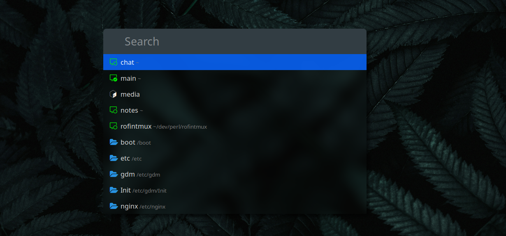

# Rofi n Tmux



A rofi launcher to create new and navigate active tmux sessions. It
switches the most recently active tmux client to the chosen
session. You'll be asked to choose from a list of available
terminals, if no client is attached to a tmux session.

## Requirements

- [Perl](https://wiki.archlinux.org/title/Perl) 5.12 or newer (most
  linux distros have perl per-installed)
- [Rofi](https://wiki.archlinux.org/title/rofi)
- [Zoxide](https://github.com/ajeetdsouza/zoxide)

## Zoxide

The launcher list all visited directories using zoxide. And if any
chosen directory contains `.init_tmux` session initializing
(executable) script, you will be prompted to either run it or
ignore it. Init script will be run with the following CLI
arguments.

1. Session's name
2. Session's current working directory

## Global Initializer scripts

Global initializers can be saved in `~/.tmux/init_tmux` directory.
The following is an example of initializer script
`~/.tmux/init_tmux/notes`. Any scripting or programming language
can be used. As long as the file is executable it will show up in
the launcher.

```perl
#!/usr/bin/perl

use 5.38.0;

my $session = shift @ARGV;
my $cwd     = shift @ARGV;

`tmux send-keys -t $session:0 "zk edit -i" Enter`;
```

This session manager is inspired by
[sesh](https://github.com/joshmedeski/sesh) by John Medeski.
